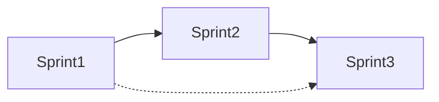

# Plan de Remediación — Módulo de Inventario

## Resumen Ejecutivo

Auditoría completa del módulo de Inventario realizada el 2026-06-06.
**34 hallazgos** distribuidos en 3 Críticos, 5 Altos, 10 Medios y 16 Bajos.

Este plan organiza la remediación en 3 sprints, priorizando bloqueantes y riesgos operativos.

## Priorización

| Prioridad | Descripción |
|-----------|-------------|
| 🔴 Crítica | Bugs que bloquean la app o inutilizan funcionalidad core |
| 🟠 Alta | Riesgo operativo (inconsistencia de datos, UX inaccesible) |
| 🟡 Media | Deuda técnica, calidad, testing |
| 🔵 Baja | Mejora continua, código limpio |

## Dependencias entre Sprints

| Sprint | Depende de | Puede ejecutarse en paralelo con |
|--------|------------|----------------------------------|
| **Sprint 1** Bloqueantes | — | — |
| **Sprint 2** Integridad | Sprint 1 (FIX-005 depende de FIX-002) | — |
| **Sprint 3** Calidad | Sprint 1 (recomendado) | Sprint 2 (parcial) |

## Estado de Tareas

| ID | Tarea | Sprint | Estado | Responsable |
|----|-------|--------|--------|-------------|
| FIX-001 | PurgeModal syntax error | 1 | ⬜ Pendiente | — |
| FIX-002 | Formulario edición no carga datos | 1 | ⬜ Pendiente | — |
| FIX-003 | Filtro lowStock roto | 1 | ⬜ Pendiente | — |
| FIX-004 | Acciones invisibles en touch | 1 | ⬜ Pendiente | — |
| FIX-005 | Venta sin validar stock (atómico) | 1 | ⬜ Pendiente | — |

## Riesgos Identificados

| Riesgo | Probabilidad | Impacto | Mitigación |
|--------|-------------|---------|------------|
| Race condition en ventas simultáneas | Media | Alto | RPC atómico con UPDATE + WHERE guard |
| Inconsistencia stock vs caja | Media | Alto | Transacción/compensación en recordPurchase/consume |
| Error al regenerar tipos Supabase | Baja | Medio | Validar con `npm run typecheck` |

## Convenios

- Todo PR debe incluir test que reproduzca el bug antes de la fix
- Toda transformación InventoryItem → FormData debe vivir en `mapItemToFormData`
- No reintroducir `as any` en código modificado (Boy Scout Rule)
- Regenerar `types/supabase.ts` después de migraciones SQL
